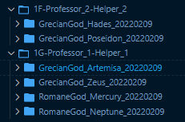
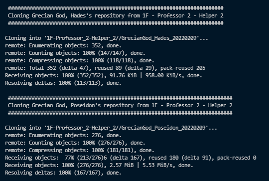
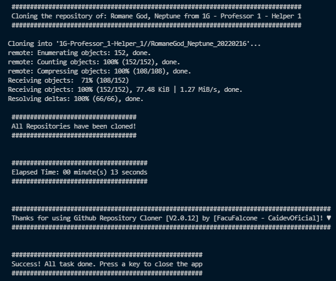
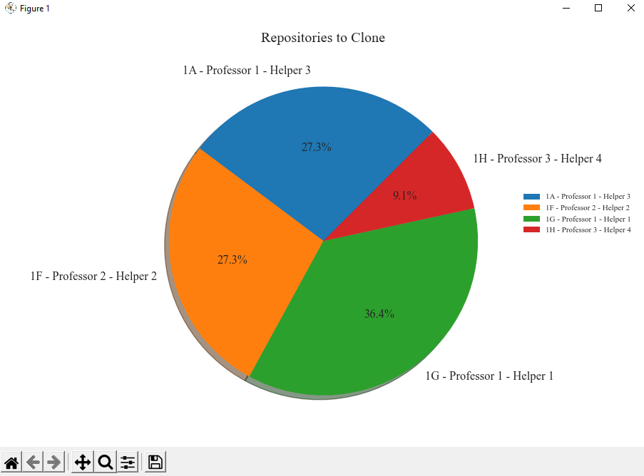

<table align='center'>
    <tr>
        <td>
            
        </td>
        <td>
            
        </td>
    </tr>
    <tr>
        <td colspan=2 align='center'>
            <center>
                
            </center>
        </td>
    </tr>
    <tr>
        <td colspan=2 align='center'>
            <center>
                
            </center>
        </td>
    </tr>
    <tr>
        <td colspan=2 align='center'>
            <center>
                 
        </a>
            </center>
        </td>
    </tr>
</table>
</br>

<div align="center">
    <h3>Pisces♓ | Developer👨‍💻 | Python | GCP  | Java  | C#  | Dreamer 💖 | Teacher👨‍🏫| A bit nerd🤓</h3>
    <br>
    <h3>📌 Programming Student & Assistant Professor at the <br>
    <strong>National Technological University [UTN]</strong> 👨‍💻</h3>
    <h3>📌 Data Engineer at <strong>Accenture</strong> 👨‍💻</h3>
</div>


<p align="center">
    
</p>

<p align="center">
    <a href="https://github.com/CaidevOficial">
        
    </a>
</p>
<br><br><br>

---

<br>


# Information:
The program it allows you to clone repositories from github in bulk and store them in specific directories from a csv file.
Aditionally it saves the data of every student & course into a json with the name of the course.

All this is possible by the use of [Pandas library](https://pandas.pydata.org/docs/index.html) and dataframes to manipulate the data, sorting and filtering the courses, students and repositories to get a list of dataframes, one for each course with all the students data sorted by course, surname and name and then, it will create a Pie Chart, using [Matplotlib Pyplot](https://matplotlib.org/stable/api/_as_gen/matplotlib.pyplot.plot.html), with the percentages of students categorized according to their course whose repositories have been cloned. Then will compare and generates a CSV file indicating which files are similar to each other and finally will write the info in a **Database** using **SQLite3**.

### About the Repository Cloner functionality:
At the end of the clonning, the program will download the files of each student and save them in the directory of the course that they belong to.

like this:

<table align='center'>
    <theader>
        <th>Courses & students directories</th>
    </theader>
    <tbody>
        <tr>
            <td>
                
            </td>
        </tr>
    </tbody>
</table>

And the JSON generates with the data of the students and courses will be like this:

```json
[
    {
        "Temporal Sign":"2022\/02\/13 10:26:52 p.\u00a0m. GMT-3",
        "Name":"Heracles",
        "Surname":"Grecian DemiGod",
        "Division":"1A - Professor 1 - Helper 3",
        "Student ID":"999999",
        "E-Mail":"Heracles@nordicreign.com",
        "Link to repository":"https:\/\/github.com\/caidevOficial\/CaidevOficial"
    },
    {
        "Temporal Sign":"2022\/02\/13 10:26:52 p.\u00a0m. GMT-3",
        "Name":"Hades",
        "Surname":"Grecian God",
        "Division":"1A - Professor 1 - Helper 3",
        "Student ID":"111111",
        "E-Mail":"Hades@underworld.com",
        "Link to repository":"https:\/\/github.com\/caidevOficial\/CaidevOficial.git"
    },
    {
        "Temporal Sign":"2022\/02\/13 10:26:52 p.\u00a0m. GMT-3",
        "Name":"Odin",
        "Surname":"Nordic God",
        "Division":"1A - Professor 1 - Helper 3",
        "Student ID":"777777",
        "E-Mail":"odin@fatherofall.com",
        "Link to repository":"https:\/\/github.com\/caidevOficial\/Python_RepositoryCloner.git"
    },
    {
        "Temporal Sign":"2022\/02\/13 10:26:52 p.\u00a0m. GMT-3",
        "Name":"Valhalla",
        "Surname":"Nordic Reign",
        "Division":"1A - Professor 1 - Helper 3",
        "Student ID":"999999",
        "E-Mail":"valhalla@nordicreign.com",
        "Link to repository":"https:\/\/github.com\/caidevOficial\/CaidevOficial"
    }
]
```
<br><br><br>

---

<br><br><br>
# Console Messages
Meanwhile the program is cloning the repositories, the console will show messages like showns below:

<table align='center'>
    <theader>
        <th><center>Console Messages</center></th>
    </theader>
    <tbody>
        <tr>
            <td>
                
            </td>
        </tr>
    </tbody>
</table>

When finish, you look a final message (with the elapsed time of the execution) like this:

<table align='center'>
    <theader>
        <th><center>Console Final Message</center></th>
    </theader>
    <tbody>
        <tr>
            <td>
                
            </td>
        </tr>
    </tbody>
</table>

At the end of the execution, the program will download the files of every student and save them in the directory of the course that they belong to. Additionally, the program will generate a JSON with the data of the students and courses and it will generate a Pie Chart with the percentage of students that have downloaded the repositories...

Like the image below:

<table align='center'>
    <theader>
        <th><center>Example Pie Chart</center></th>
    </theader>
    <tbody>
        <tr>
            <td>
                
            </td>
        </tr>
    </tbody>
</table>


<br><br><br>

---

<br><br><br>
### File format
* 1st Column: Date time. [it isn't used yet.]
* 2nd Column: Student Name
* 3rd Column: Student Surname
* 4th Column: Student Division
* 5th Column: Student ID. [it isn't used yet.]
* 6th Column: Student E-mail. [it isn't used yet.]
* 7th Column: Repository Name to download (It could skip the '.git' part)

Like this:

```
"Marca temporal","Nombre/s","Apellido/s","División","DNI / Legajo","E-Mail","Link al repositorio"
"2022/02/13 10:26:52 p. m. GMT-3","Neptune","Romane God","1G - Professor 1 - Helper 1","222222","neptune@notplanet.com","https://github.com/caidevOficial/SPD2022_TPS.git"
"2022/02/13 10:26:52 p. m. GMT-3","Poseidon","Grecian God","1F - Professor 2 - Helper 2","333333","poseidon@sea.com","https://github.com/caidevOficial/Python_ITBA_IEEE.git"
"2022/02/13 10:26:52 p. m. GMT-3","Hades","Grecian God","1F - Professor 2 - Helper 2","111111","Hades@underworld.com","https://github.com/caidevOficial/CaidevOficial.git"
```
<br><br><br>

---

<br><br><br>
# Configuration
In order to use this Cloner, you should configure the file [configs.json](./modules/configs.json) with your Github API's information as shown below.

```json
{
    "repo_cloner": {
        "Github": {
            "URL": "https://api.github.com/repos",
            "USER": "CaidevOficial",
            "REPO": "Python_copydetector",
            "BRANCH": "master"
        },
        "DataFrame": {
            "Fields": {
                "Date": "Temporal Sign",
                "Name": "Name",
                "Surname": "Surname",
                "Course": "Division",
                "ID": "Student ID",
                "Email": "E-Mail",
                "GitLink": "Link to repository"
            }
        },
        "Files": {
            "Dir_Plots_img": "./Plot_Images",
            "Dir_Cloned_Repos": "./Repositories",
            "Dir_Statistics": "./Statistics"
        }
    }
}
```

for example:

```json
{
    {
        "URL": "https://api.github.com/repos",
        "USER": "CaidevOficial",
        "REPO": "Python_RepositoryCloner",
        "BRANCH": "main"
    },
    "DataFrame": {
        "Fields": {
            "Date": "Marca temporal",
            "Name": "Nombre/s",
            "Surname": "Apellido/s",
            "Course": "División",
            "ID": "DNI / Legajo",
            "Email": "E-Mail",
            "GitLink": "Link al repositorio"
        }
    },
    "Files": {
        "Dir_Plots_img": "./Plot_Images",
        "Dir_Cloned_Repos": "./Repositories"
    }
}
```

Then the code will make the link like:

```
https://api.github.com/repos/CaidevOficial/Python_RepositoryCloner/commits/main
```

This way the program will take the 'Date' of the last commit of the branch 'main' and will use it to create the folder with the name of the repository. Obviously, the repository <strong>MUST BE PUBLIC</strong>, otherwise the program won't be able to access its API.

Regarding the 'DataFrame' Key, al the keys inside are configured to use them with a 'csv' file with at least theses columns. [Could have more columns, but it's not necessary for us.]

Finally, respect the 'Files' Key, where you can configure the directory where the plots will be saved and the directory where the cloned repositories will be saved.

For our example, the columns of the csv file are:

<table>
    <thead>
        <th>Marca Temporal</th><th>Nombre/s</th><th>Apellido/s</th><th>División</th><th>DNI / Legajo</th><th>E-Mail</th><th>Link al repositorio</th>
    </thead>
    <tbody>
        <tr>
            <td align='center'>
                <h3>2022/02/13 10:26:52 p. m. GMT-3</h3>
            </td>
            <td align='center'>
                <h3>Poseidon</h3>
            </td>
            <td align='center'>
                <h3>Grecian God</h3>
            </td>
            <td align='center'>
                <h3>1F</h3>
            </td>
            <td align='center'>
                <h3>123456789</h3>
            </td>
            <td align='center'>
                <h3>poseidon@grecianGod.olympus</h3>
            </td>
            <td align='center'>
                <h3>https://github.com/caidevOficial/CaidevOficial.git</h3>
            </td>
        </tr>
    </tbody>
</table>
<br><br><br>


### About the Copy Detector functionality:

Compares files with configurable extensions (for example: '.ino', '.cpp', '.c', '.h') in different directories and generates a CSV file indicating which files are similar to each other.
- Ignores language reserved words like break, include, {,},\n,\t.

### Important:

The file [config.json](./modules/configs.json) has the configuration of the script, edit it in case you want to calibrate it according to need.

```json
{
    "copy_detector": {
        "configs": {
            "script": {
                "percentage": 60,
                "filename_output": "./possible_copies.csv",
                "sort_by_percent_desc": false,
                "files_sufix": [".cpp", ".ino"],
                "excluded_files": ["spect.c", "spects.c"]
            },
            "database": {
                "name": "copies_db",
                "table_name": "students_copies",
                "delete_before_insert": true,
                "paths": {
                    "db_file": "./modules/database/copies_db.db",
                    "DDL": {
                        "create": "./modules/database/queries/DDL/create.sql",
                        "drop": "./modules/database/queries/DDL/drop.sql"
                    },
                    "DML": {
                        "delete": "./modules/database/queries/DML/delete.sql",
                        "insert": "./modules/database/queries/DML/insert.sql",
                        "select": "./modules/database/queries/DDL/select.sql",
                        "update": "./modules/database/queries/DML/update.sql"
                    }
                }
            }
        }
    }
}
```

---

Regarding to the **scripts** key section:

```json
"script": {
    "percentage": 60,
    "filename_output": "./possible_copies.csv",
    "sort_by_percent_desc": false,
    "files_sufix": [".cpp", ".ino"],
    "excluded_files": ["spect.c", "spects.c"]
}
```

- the key _**percentage**_ indicates that from 60% similarity, it will be considered a copy
- The key _**filename_output**_ will indicate the name and output directory of the file which will contain the data of the copies
- The key _**sort_by_percent_desc**_ will indicate, if set to True, that the data in the output file will be ordered in descending order according to copy percentage. Otherwise, it will be ordered as the copies are found.
- The key _**files_sufix**_ will indicate a list of the suffixes of the files you want to compare.
- The key _**excluded_files**_ will indicate the files u want to exclude from the comparation (can be empty)

---

Regarding to the **database** key section:

```json
"database": {
    "name": "copies_db",
    "table_name": "students_copies",
    "delete_before_insert": true,
    "paths": {
        "db_file": "./modules/database/copies_db.db",
        "DDL": {
            "create": "./modules/database/queries/DDL/create.sql",
            "drop": "./modules/database/queries/DDL/drop.sql"
        },
        "DML":{
            "insert": "./modules/database/queries/DML/insert.sql",
            "delete": "./modules/database/queries/DML/delete.sql",
            "update": "./modules/database/queries/DML/update.sql",
            "select": "./modules/database/queries/DDL/select.sql"
        }
    }
}
```

- The key _**name**_: contains the name of the database (file) where the table will be stored.
- The key _**table_name**_: contains the name of the table in which the records will be written.
- The key _**delete_before_insert**_: will be true if before adding new records you want to delete the previous ones, otherwise it will be false.

---  

Regarding the *Paths*

- The key _**db_file**_: will be the path where the file generated with the script database will be saved.
- The key _**DDL**_: will contain within the paths of the DDL queries that the script will use.
- The key _**DML**_: will contain within the paths of the DML queries that the script will use.

# Installation:

* Install requirements contained in the file _requirements.txt_

```sh
pip install -r requirements.txt
```

* Clone this repository and execute the script.

```sh
$ cd this_repository_dir
$ python3 main.py /path/to/directory
```


<br><br><br>
<table align='center'>
    <tr align='center'>
        <h2 align='center'>Technologies used. 📌</h2>
        <td>
            <a href="https://www.python.org/downloads/"></a>
        </td>
        <td><center>Python</center></td>
    </tr>
    <tr align='center'>
        <td>
            <a href="https://pandas.pydata.org/"></a>
        </td>
        <td><center>Pandas</center></td>
    </tr>
    <tr align='center'>
        <td>
            <a href="https://numpy.org/"></a>
        </td>
        <td><center>Numpy</center></td>
    </tr>
        <tr align='center'>
        <td>
            <a href="https://matplotlib.org/"></a>
        </td>
        <td><center>MatPlotLib</center></td>
    </tr>
    <tr align='center'>
      <td>
        <a href="https://www.sqlite.org/" target="_blank"> 
             
        </a>
      </td>
      <td>
        <center>SQLite</center>
      </td>
    </tr>
    <tr align='center'>
        <td>
            <a href="https://code.visualstudio.com/"></a>
        </td>
        <td><center>VSCode</center></td>
    </tr>
</table>
<br><br><br>

---

<br><br><br>
<table>
    <theader>
        <tr>
            <th colspan=2>
                <center><strong>LICENSE</strong></center>
            </th>
        </tr>
        <tr>
            <th colspan=2>
                <center>Git Repository Cloner 2022</center>
            </th>
        </tr>
        <tr>
            <th>
                <center>License</center>
            </th>
            <th>
                <center>Author</center>
            </th>
        </tr>
    </theader>
    <tbody>
        <tr>
            <td>
                <center>[GNU General Public License V3]</center>
            </td>
            <td>
                <center>[Facundo Falcone - CaidevOficial]</center>
            </td>
        </tr>
        <tr>
            <td colspan=2>
                <center>
                    This program is free software: you can redistribute it and/or modify
                    it under the terms of the GNU General Public License as published by
                    the Free Software Foundation, either version 3 of the License, or
                    (at your option) any later version.
                    This program is distributed in the hope that it will be useful,
                    but WITHOUT ANY WARRANTY; without even the implied warranty of
                    MERCHANTABILITY or FITNESS FOR A PARTICULAR PURPOSE.See the
                    GNU General Public License for more details.
                    You should have received a copy of the GNU General Public License
                    along with this program.
                    If not, see <a href='https://www.gnu.org/licenses/'>GNU Licenses</a>.
                </center>
            </td>
        </tr>
    </tbody>
</table>
<br><br><br>

---

<br><br><br>
<table align='center'>
  <theader>
  <th><h2 align='center'>Where to find me: 🌎</h2></th>
    <tr align='center'>
      <td>
        
      </td>
    </tr>
    <th><center>🤴 Facu Falcone - Data Engineer</center></th>
    </theader>
    <tbody>
    <tr align='center'>
      <td>
        <a href="https://github.com/caidevOficial/">
          
        </a>
      </td>
    </tr>
    <tr align='center'>
      <td>
          <a href="https://www.linkedin.com/in/facundo-falcone/">
            
          </a>
      </td>
    </tr>
    <tr align='center'>
      <td>
        <a href="https://cafecito.app/caidevoficial/">
          
        </a>
      </td>
    </tr>
    <tr align='center'>
      <td>
        <a href='https://ko-fi.com/P5P74JBOH' target='_blank'>
          
        </a>
      </td>
    </tr>
  </tbody>
</table>
